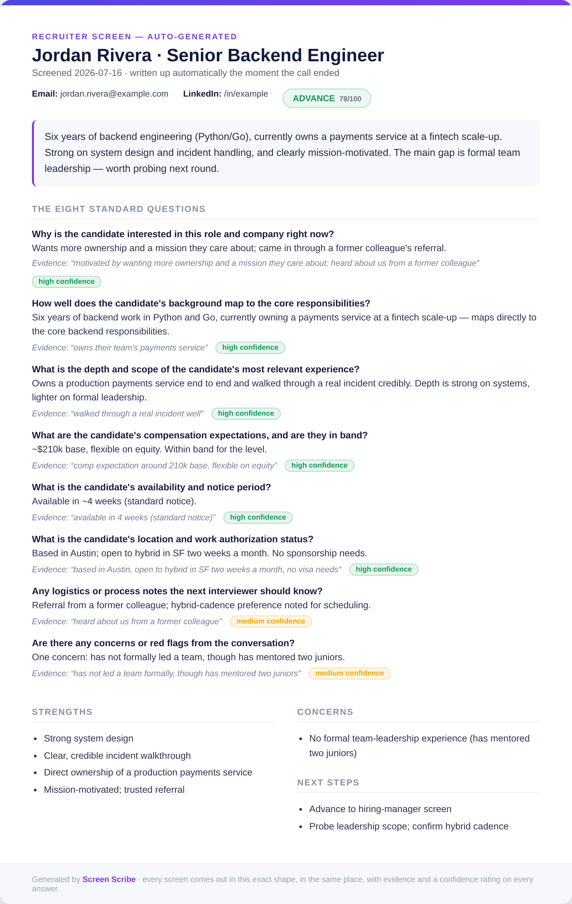
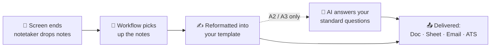
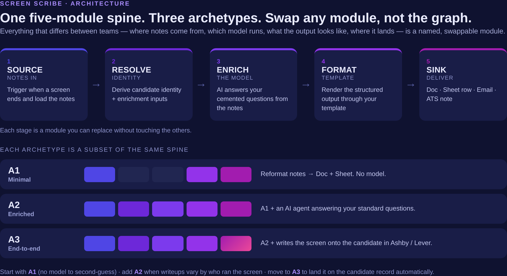

> **Reference implementation.** Every workflow imports and runs in `TEST_MODE`
> (dry run, zero external writes) out of the box — preview the whole pipeline, then
> wire your own credentials and ids before going live on real candidates.

# Screen Scribe (n8n)

**Turn a recruiter screen into a polished, consistent writeup — automatically,
the moment the call ends.**

Every screen ends the same way: good signal in your head, then fifteen minutes
spent writing it up before it evaporates. Every recruiter formats it a little
differently. Hiring managers get inconsistent writeups. Nothing lands in the
same place twice, and nobody's ATS record reflects what was actually said on
the call.

This is three importable n8n workflows that fix that. Point one at your notes,
your storage, and (optionally) your ATS, and every screen comes out the same
shape, in the same place, without anyone retyping anything.



## What actually happens

1. **A screen call ends.** Your AI notetaker (Gemini in Google Meet, or
   anything that drops a notes doc or sends a notes email) already produced a
   clean summary — this pack starts from that, not from raw audio.
2. **The workflow notices.** It watches wherever your notes land — a Drive
   folder, an inbox, a Slack drop, whatever you point it at — and picks up the
   new notes automatically.
3. **The notes get reformatted.** Into a consistent template you control: same
   headings, same structure, every single time, regardless of who ran the
   screen or how they took notes.
4. *(A2 and A3 only)* **An AI agent reads the notes and answers your fixed list
   of screen questions** — the questions you've decided every candidate should
   be evaluated against — pulling only what's actually in the notes. Nothing
   invented; anything the notes didn't cover comes back marked as such. You
   control how far it goes with `enrichment_level`: `low` extracts only what was
   said (no inference), `medium` allows light evidence-backed inference, `high`
   synthesizes and suggests — or `off` to skip the model entirely. It can also
   auto-pull the candidate's resume (`fetch_resume`) and feed it to the answers.
5. **The finished writeup gets delivered** wherever your team actually looks:
   a Google Doc, a row in a tracking sheet, an email, and — for A3 — a note on
   the candidate's own record in Ashby or Lever, no copy-paste required.

Every stage above is a module you can swap without touching anything else —
different notes source, different model, different template, different
destination. See `docs/ARCHITECTURE.md` for the full swap matrix.



## Pick your archetype

Each one is a **single, self-contained file** — import it, don't stitch
several together. A2 is A1 plus an AI reader. A3 is A2 plus writing back to
your ATS.

| | **A1 · Minimal** | **A2 · Enriched** | **A3 · End-to-end** |
|---|---|---|---|
| Reformats notes into your template | ✅ | ✅ | ✅ |
| Uses AI to answer your standard questions | — | ✅ | ✅ |
| Delivers to a Doc + a Sheet row | ✅ | ✅ | ✅ |
| Writes a note onto the candidate in your ATS | — | — | ✅ (Ashby / Lever) |
| Needs a model credential | — | ✅ | ✅ |
| **Best for** | Teams that just want one consistent place every screen lands, no AI involved | Teams that want every screen answered against the same rubric, no matter who ran it or how they wrote notes | Teams that live in an ATS and want the screen to show up on the candidate record automatically |
| Import | `templates/A1-minimal-screen-to-doc.template.json` | `templates/A2-enriched-cemented-questions.template.json` | `templates/A3-endtoend-ats.template.json` |

**Not sure which one?** Start with A1 — it's the fastest to trust because
there's no model in the loop to second-guess. Add A2 the moment you notice
writeups vary depending on who ran the screen. Move to A3 once your team is
tired of manually copying the summary into the ATS.



## The eight questions it answers out of the box

A2 and A3 ship with the questions most recruiters already ask on a screen. Every
candidate gets answered against **all eight**, in the same order, in their own
section of the writeup — so two screens run by two different recruiters come out
comparable.

| # | Question | What it's looking for |
|---|---|---|
| 1 | **Motivation** — why this role, why now? | A specific, credible reason tied to the role, not a generic "looking for growth" |
| 2 | **Role fit** — does their background map to the job? | Concrete past work against the role's must-do outcomes; adjacent experience counts if the skill transfers |
| 3 | **Experience depth** — how deep and how big? | Scope, ownership, and outcomes — not titles or years |
| 4 | **Compensation** — expectations, and are they in band? | The number or range if it came up; flags anything materially above band |
| 5 | **Availability** — when could they start? | Notice period, competing processes, urgency |
| 6 | **Location & work authorization** | Onsite/hybrid/remote fit, relocation willingness, sponsorship needs |
| 7 | **Logistics** — anything the next interviewer should know? | Scheduling constraints, interview format preferences, accommodations, referral source |
| 8 | **Red flags** — any concerns from the conversation? | Inconsistencies, misaligned expectations. "None" is a valid answer |

Each answer comes back with **supporting evidence from the notes** and a
**confidence rating**, so you can see what the AI actually based it on. If the
notes never covered a question, it says so plainly instead of guessing.

**Your screens don't work like this?** Mine don't either. The list is meant to be
replaced — edit `config/standard-questions.json`, paste it into the workflow's
`Set Config` node, and the writeup restructures itself around your questions with
no workflow changes. Full walkthrough in `docs/CUSTOMIZE.md`.

## What comes out

Every screen produces the same document shape:

- **Header** — candidate, role, date, contact links, and an overall
  recommendation (`strong_advance` → `no`)
- **Summary** — two or three sentences a hiring manager can skim
- **The eight questions** — each with its answer, the evidence behind it, and a
  confidence rating
- **Strengths** and **Concerns** — as bullet lists
- **Follow-up questions** — what the next interviewer should dig into
- **Next steps**

Change any of it in `config/screen-doc.template.md` (layout) and
`config/output-schema.json` (content).

Delivered as a Google Doc plus a Sheet row by default. Flip `deliver_pdf` on to
also export the Doc to PDF and drop it in the Drive folder (no extra service — it
reuses the Doc you already created), and — for A3 — a note on the candidate's
record in Ashby or Lever.

## Quickstart

1. Read `docs/ARCHITECTURE.md` for the five-module spine and how to swap modules.
2. Import the archetype you picked above from `templates/` into n8n
   (Workflows → Import from File).
3. Create the credentials listed in `templates/SETUP.md` and attach them.
4. Cement your questions (A2/A3): edit `config/standard-questions.json` and
   paste the list into the workflow's `Set Config` node
   (`standard_questions` field).
5. Set your ids in `Set Config` (Drive folder, Sheet id, Sheet tab, doc template).
6. Run once with `TEST_MODE=true` (the default) — it previews exactly what
   would be created and written, with zero external writes.
7. Happy with the preview? Set `TEST_MODE=false` and run again to go live.

## What you customize (and where)

| You want to change | Edit |
|---|---|
| The standard screen questions | `config/standard-questions.json` |
| What the writeup contains | `config/output-schema.json` |
| What the writeup looks like | `config/screen-doc.template.md` |
| Where notes come from | The SOURCE trigger node (see the ARCHITECTURE swap matrix) |
| Which model runs enrichment | The `Enrich Model` node (Anthropic default; swap for Gemini/OpenAI) |
| How much the AI infers | `enrichment_level` in `Set Config` (`off` / `low` / `medium` / `high`) |
| Auto-pull the candidate's resume | `fetch_resume` + `candidate_resume_link` in `Set Config` (A2/A3) |
| Also deliver a PDF | `deliver_pdf` in `Set Config` |
| Which ATS (A3) | `ats_provider` in `Set Config` (`ashby` or `lever`) |

## Extensions (ideas, not built in)

The pack deliberately ships lean — notes in, writeup out. These are the natural
next steps people ask for. **None of them are included**; each is a note on where
it would attach if you want to build it.

**Feed the AI more than just the notes** — richer input, better writeup. (Resume
auto-pull already ships — set `fetch_resume` + `candidate_resume_link`; see
`docs/CUSTOMIZE.md` §7.)

| Extension | Where it attaches | Notes |
|---|---|---|
| **LinkedIn profile enrichment** | `Resolve Context` (RESOLVE) — a scraping/enrichment API (Bright Data, Proxycurl, etc.) called before ENRICH | Capturing the profile URL is free; turning it into content needs a third-party API. Check the provider's terms and your own policy before scraping profiles. |
| **The job description itself** | `Set Config` → inject into the enrichment prompt alongside `company_context` | Turns "does this map to the role?" from a judgment call into a comparison against the actual req. |
| **Prior interview notes** | RESOLVE, pulled from your ATS by candidate email | Lets the writeup reference what earlier rounds already established. |

**Do more with the output:**

| Extension | Where it attaches | Notes |
|---|---|---|
| **Scorecard-style ratings** | `config/output-schema.json` — add rated dimensions | Add per-competency ratings to the schema and the template; the model fills them from the same notes. |
| **Recruiter review gate** | Between FORMAT and SINK | An n8n "send and wait" step that posts the draft to Slack for approve/edit/reject before anything gets written or pushed to the ATS. Worth it the moment output goes anywhere a hiring manager sees. |
| **Candidate-facing follow-up email** | After SINK | Draft the follow-up from the same structured output. Keep a human on the send. |
| **Quality evaluation** | A separate eval workflow using n8n's Evaluation nodes | Score writeups against a small labeled set to catch prompt drift over time. |

**Adjacent use cases** — the same five-module spine (notes → structure → format →
deliver) isn't recruiting-specific. Swap the questions and the template and the
same pipeline handles hiring-manager intakes, debriefs, or general meeting notes.
That's a fork of A2 with a different `standard-questions.json`, not new plumbing.

## Layout

```
docs/ARCHITECTURE.md      the five-module spine, the archetypes, the swap matrix
docs/CUSTOMIZE.md         step-by-step customization walkthrough
docs/VALIDATION-PLAN.md   how to validate before going live
docs/integrations/        Ashby + Lever setup notes (A3)
config/                   standard-questions, output-schema, doc template
templates/                the three importable workflows + SETUP.md
tools/                    regenerate the templates from config, offline validators
```

## Not included

- No credentials or org data. All ids are placeholders; the enrichment prompt
  uses a placeholder `company_context` you replace.
- No candidate data. Sample notes in the workflows are fictional.
- Greenhouse ATS: excluded by design (no scorecard write over the API). Ashby and
  Lever only.

## Support

**Stuck or have a question?** Open an [Issue](../../issues) — no question is too
basic. This is a reference implementation (no SLA), but issues get read.

## License

MIT © 2026 [onepromptman](https://github.com/onepromptman) (Bryan Hong). Reference
implementation, no SLA. Use it, adapt it, share it.
